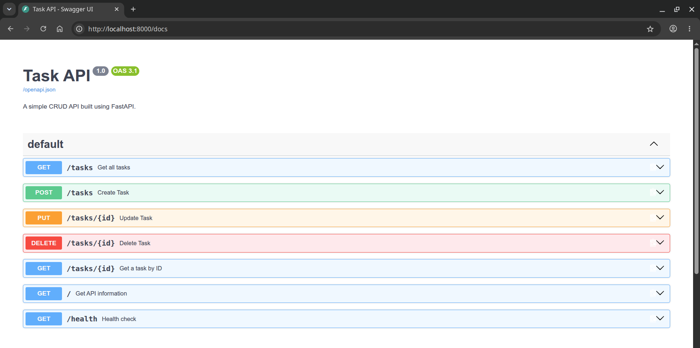

# Task API

A simple CRUD API for managing a to-do list, built with Python and FastAPI.

## Features

- Create tasks
- Retrieve all tasks
- Retrieve a task by ID
- Update tasks
- Delete tasks
- Input validation
- Health check endpoint
- Correct HTTP status codes for all operations
- Interactive API documentation with Swagger UI

## Tech Stack

- Python 3.14+
- FastAPI
- Uvicorn
- Pydantic

## Setup

### 1. Clone the repository

    git clone https://github.com/pbword/task-crud-fastapi
    cd task-crud-fastapi

### 2. Create a virtual environment

    python3 -m venv .venv

### 3. Activate the virtual environment

Linux/macOS:

    source .venv/bin/activate

Windows:

    .venv\Scripts\activate

### 4. Install dependencies

    pip install -r requirements.txt

## Run the API

Start the development server with:

    python -m uvicorn main:app --reload

The API will be available at:

    http://localhost:8000

## API Documentation

FastAPI automatically generates interactive Swagger UI documentation.

Open:

    http://localhost:8000/docs

You can use Swagger UI to test all API endpoints directly from your browser.

## Endpoints

| Method | Endpoint | Description |
|--------|----------|-------------|
| GET | `/` | Get API information |
| GET | `/health` | Health check |
| GET | `/tasks` | Get all tasks |
| GET | `/tasks/{id}` | Get a task by ID |
| POST | `/tasks` | Create a new task |
| PUT | `/tasks/{id}` | Update an existing task |
| DELETE | `/tasks/{id}` | Delete a task |

## Example Task

    {
      "id": 1,
      "title": "Learn FastAPI",
      "done": false
    }

## Data Storage

Tasks are currently stored in an in-memory Python list.

Data is reset whenever the API server restarts.

## Testing

The API can be tested using Swagger UI or directly from the command line with `curl`.

### Swagger UI

Open:

http://localhost:8000/docs

### curl

Get all tasks:

    curl http://localhost:8000/tasks

Get a task by ID:

    curl http://localhost:8000/tasks/1

Create a task:

    curl -X POST http://localhost:8000/tasks \
      -H "Content-Type: application/json" \
      -d '{"title": "Learn FastAPI"}'

Update a task:

    curl -X PUT http://localhost:8000/tasks/1 \
      -H "Content-Type: application/json" \
      -d '{"done": true}'

Delete a task:

    curl -X DELETE http://localhost:8000/tasks/1

Example request:

    curl -i -X POST http://localhost:8000/tasks \
      -H "Content-Type: application/json" \
      -d '{"title":"Test CRUD with curl"}'

Example response:
    
        HTTP/1.1 201 Created
    date: Fri, 28 Aug 2026 20:22:35 GMT
    server: uvicorn
    content-length: 51
    content-type: application/json

    {"id":4,"title":"Test CRUD with curl","done":false}
